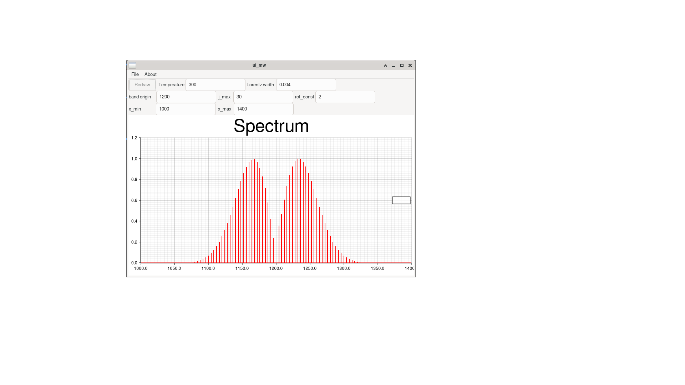

# Diatomic Simulator

This program simulates the rotational spectrum of diatomic molecules using Rust. 
It utilizes quantum mechanical principles to calculate the energy levels and corresponding spectral lines of the molecule under consideration.

### Current Support

- x86_64 GNU/Linux
- WSL2 (need WSLg for GUI)

## 📡 for microwave spctrum

now: 2024 05/12


now: 2024 05/13


## get & try

1. install dependency 

- for Debian/Ubuntu: libgtk-3-0

```bash
$ sudo apt install libgtk-3-0
```

- for Arch Linux: gtk3 

```bash
$ sudo pacman -S gtk3 
```

2. Download binary from [release](https://github.com/aki-ph-chem/diatomic_simulator/releases) and exec it from shell.

```bash
$ ./ui_mw
```

## 🔨 build

- dependency
    - Ubuntu/Debian: libgtk-3-dev
    - Arch Linux: gtk3

To build "ui_mw"

```bash
$ cargo build --bin ui_mw
```

To build [examples](./examples)

```bash
$ cargo build --example <target name> 
```
and visualize the result of exmples by jupyter lab

1. init Python environment

```bash
$ poetry install
```

2. start jupyter lab

```bash
$ poetry run jupyter lab
```

## 🎁 Features

- Calculates rotational energy levels
- Generates rotational spectrum
- Allows customization of molecule parameters (rotational constant, rotational temperature, band origin)

## Progress

### now: 

- for maicrowave spectrum
    - logic part: Spectrum calculation based on rotational constants and other parameters.
    - GUI part: Interactive plot. 

- for electronic spectrum
    - logic part: Spectrum calculation based on rotational constants and other parameters.

## License

This project is licensed under the GNU Lesser General Public License v3.0 - see the LICENSE file for details.
